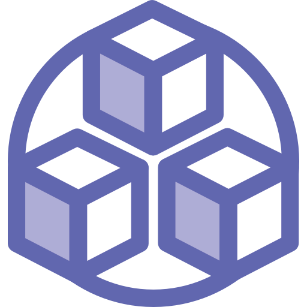

# Prefabby Community Unity Plugin

Prefabby is a platform to collaboratively build, share, and remix creations made out of prefab art packs; currently available for Unity and Godot.

This repository hosts the Prefabby Community plugin for the Unity game engine.

## 💡 About the Unity plugin

You can install the Unity plugin into your Unity project to browse through available creations, publish your own creations, or collaborate with others in real-time.

Please note that some functionality requires an API Access Key which can be obtained for free after registering. Presently there's no global homepage, so you need to start at one of the local instances to register (see below); the user is global, though, and you can switch between instances if needed.

## ⚡️ Quickstart

### User and Access Key

Go to one of the following local instances, depending on what's closest to you:

* [Falkenstein (Germany)](https://fsn.app.prefabby.com)
* [Sydney (Australia)](https://syd.app.prefabby.com)

You will be redirected to Auth0 to log in or sign up. Create an account using your email address and a password of your choice by clicking on "Sign up", then click Continue to proceed to the application.

You'll see the "Your account" page where you can choose a display name and generate an Access Key. The display name will be shown along with your creations and collaborations, and the Access Key is needed for the Unity plugin to interact with the backend. While your user works globally across all instances, the Access Key is only valid for the instance you are currently working on.

### Plugin Installation

In your Unity project, open the Package Manager window and click on the + icon in the top left, then select "Add package from Git URL...". Copy this URL into the input field which popups up:

	https://github.com/Prefabby/com.prefabby.community.unityplugin.git

Once the plugin is installed, you will find a new menu entry Tools->Prefabby in your menu bar. Click it to open the Prefabby window and dock it somewhere to your liking.

Go to the Settings tab, select the region where you created your Access Key and copy the Access Key, then click "Save" at the bottom of this tab. Once you see a success message, you're good to start.

## ℹ️ Prefabby tabs

### 👀 Browse

The Browse tab allows to scroll through creations by other users, search for specific keywords, and import interesting creations into your own scene.

Once you click on one of the preview thumbnails, another window will show which contains details about the creation, including the required art packs. When you click "Import", the plugin verifies that all required art packs are installed in your project and starts instantiating the creation as a child of the currently selected object in the scene.

### 👥 Collaborate

The Collaborate option allows to collaboratively work on a subtree, in real-time, from multiple Unity and Godot instances.

You can initiate your own collaboration session by clicking on "Start a new collaboration". A new "Prefabby Collaboration" game object will be created as a child of the currently selected object in the scene and acts as the root of the collaboration. Any prefabs created under this root are synchronized between the collaborators. The collaboration ID displayed on the Collaborate tab can be shared with others to join the session.

Others can enter the ID and click on "Join existing collaboration".

To leave the collaboration and stop synchronization, click on "Disconnect". You can rejoin at any time by selecting the "Prefabby Collaboration" root object and clicking on "Rejoin collaboration", or by selecting one of your previous collaborations from the list. Note that rejoining will cause the children of the root game object to be removed and recreated using the server status of the collaboration, as it might have progressed in the meantime.

By default, a message is shown when you create or join a collaboration. This is to remind all collaboration participants of the limitations, as Prefabby is limited to known prefabs and transform and material changes. You can disable this message in the settings.

While a collaboration is running and changes are made, the backend rebuilds the collaboration subtree on server-side regularly in order to create progress screenshots.

If you experience any lags when using Prefabby's Collaboration feature, you can change the "Time between hierarchy checks (s)" settings. Prefabby tries to detect changes to the scene subtree by regularly comparing it to the last known status, and the larger the subtree grows, the longer this takes. You can increase the default interval of 0.5s to something longer if need be.

### 📤 Publish

The Publish tab allows to share a completed creation with other users.

If you created something out of prefabs, either alone or within a collaboration, you can publish the creation so that others can download and use it, or even remix it entirely. Drag your object from the scene hierarchy into the "Object to Publish" field and enter a short title and a longer description, then click "Publish". The plugin will check the subtree to ensure only known art packs are used before storing the creation.

The plugin will attach a marker component to the root of the creation. As long as this component is present, further changes to the creation can be published using the "Update" button. Other users who downloaded the creation into their scene can then vote to update to the latest version.

When a creation is sent to the backend, it rebuilds the creation on server-side in order to create a preview screenshot.

### ⚙️ Settings

The Settings tab holds a reference to a Settings scriptable object with all Prefabby configuration, like the region and the corresponding Access Key created in the web UI (see Quickstart).

If you work with multiple Access Keys, you can store multiple Settings SOs and use them as needed.

Note that changes are only persisted when you click "Save".

## FAQ

  
Why can't I use my own prefabs with Prefabby?
 
  

  	There are two reasons. First, Prefabby is primarily about sharing and remixing. Other users don't have access to your own prefabs, so they would be missing out. Second, Prefabby rebuilds your creations on the server to generate preview screenshots; this would not be possible with your own prefabs.
  

  
If I can't use own prefabs on the public instance, can I have a private one?
 
  

	Good thinking! Yes, you can. Please get in touch.
  

  
I published something; why does the preview image appear black?
 
  

	The preview images are gradually generated on one of the Prefabby instances. Please be patient. If no proper image shows up after some hours, Prefabby may have run into an error. In that case, move on to the next FAQ entry.
  

  
I found a bug, what should I do?
 
  

	Please gather all information and create a ticket. Particularly for collaborations, please include 1. the output of the activity log, 2. the console log, 3. a screenshot or a scene copy of your collaboration subtree. Any kind of additional information - like reproduction instructions or screen recordings - would be incredibly helpful.
  

  
I have too much latency during collaborations, I need an instance closer to my location, what can I do?
 
  

	Instances are currently created based on interest from the community. However, each instance/location costs money to run, and I am currently paying this out of my own pocket, so the options are limited. If you're willing and able to support financially, or if you deem the product worth paying a monthly fee, please get in touch.
  

  
How can I get in touch with the Prefabby developer?
 
  

	You can email me at matt@prefabby.com or DM me on Twitter/X @digitalbreed.
  

## License 

The Prefabby Unity plugin is published under the AGPLv3 license. Details on used third party resources can be found in [Editor/ThirdParty](Editor/ThirdParty/README.txt).
